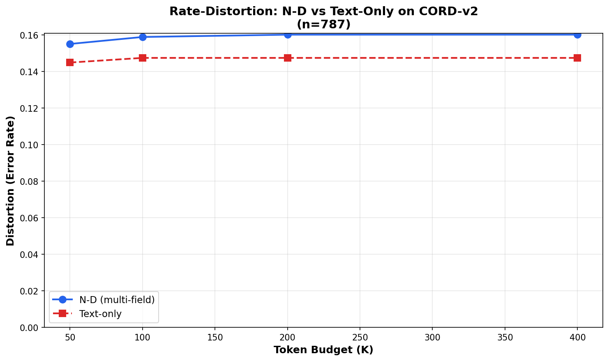

# N‑Dimensional LLM (ND‑LLM)

[](https://github.com/warrofua/n-dimensional-llm/actions/workflows/ci.yml)
[](https://www.python.org/downloads/)
[](https://opensource.org/licenses/Apache-2.0)

**Research exploration of multi‑field information bottlenecks and rate-distortion theory for structured data compression.**

> **Research Status**: This project explores theoretical frameworks for compressing multi-field structured data using information-bottleneck principles. Current empirical findings suggest practical limitations compared to simpler baselines. See [Empirical Findings](#empirical-findings) below.

---

## Research Motivation

This project investigates whether multi-field structured representations can improve upon text-only baselines for document understanding tasks under token budget constraints, using information-theoretic compression principles.

**Core questions:**
* Can information-bottleneck theory guide efficient multi-field compression?
* Do synchronized fields (text + layout + structure) preserve more task-relevant information than text alone at fixed budgets?
* What are the rate-distortion trade-offs in multi-modal document representations?

See the [full derivation](docs/why-nd-inputs.md) for the theoretical framework, the metatheoretical whitepaper [*The Tensor Is The Message*](docs/the-tensor-is-the-message.md) for design principles, and the [Related Work & Novelty overview](docs/related-work-novelty.md) for context.

---

## Empirical Findings

**Text-only encoding outperforms N-D multi-field at realistic token budgets.** On CORD receipt understanding (n=787), text-only baselines achieve **lower distortion** than N-D multi-field encoding (text + layout + line) across all realistic budgets tested (K ∈ {50, 100, 200, 400}).

<p align="center">
  
</p>

**Figure 1:** Rate-distortion curves on CORD-v2 receipt total classification. Text-only consistently achieves lower error rates than multi-field N-D encoding. Distortion = classification error rate; lower is better.

| Budget (K) | N-D Distortion | Text-Only Distortion | Δ (N-D penalty) |
|------------|----------------|----------------------|-----------------|
| 50         | 0.1550         | **0.1449**          | +0.0101         |
| 100        | 0.1588         | **0.1474**          | +0.0114         |
| 200        | 0.1601         | **0.1474**          | +0.0127         |
| 400        | 0.1601         | **0.1474**          | +0.0127         |

*Full results: [`runs/cord_rd_realistic_fixed.json`](runs/cord_rd_realistic_fixed.json)*

**Analysis:** For text-extraction tasks (e.g., "What is the total?"), multi-field encoding dilutes the text budget by allocating tokens to layout/line fields that don't contain answer-relevant information. Text-only gives 100% of budget to content, while N-D gives ~45% to text and ~55% to structure—reducing accuracy on content-focused queries.

**Reproducibility:**
```bash
# Run rate-distortion audit on local CORD dataset
export PYTHONPATH=.
.venv/bin/python scripts/rd_audit.py --budgets 50 100 200 400 --dataset-size 787 \
    --data-root "datasets/CORD 2" --output runs/cord_rd_realistic_fixed.json

# Generate comparison plot
.venv/bin/python scripts/plot_rd_comparison.py --input runs/cord_rd_realistic_fixed.json \
    --output docs/figs/cord_rd_realistic_fixed.png
```

**Research implications:** The multi-field approach faces fundamental challenges:
1. **Task mismatch**: Content extraction tasks need text, not layout metadata
2. **Budget fragmentation**: Splitting budget across fields reduces per-field fidelity
3. **Field alignment**: Independent field selection creates incomplete representations for cross-field queries
4. **Baseline competition**: LLMs with code execution capabilities likely outperform specialized compression architectures

### Comparison to LLM Code Execution

A critical finding: **modern LLMs with code execution likely obviate the need for custom compression architectures** for most practical applications.

**LLM + Code Approach:**
```python
# LLM generates and executes:
import pandas as pd
df = pd.read_csv('wearable_data.csv')
episodes = df[df['episode'] == True]
pre_episode_hr = df.loc[episodes.index - 30, 'heart_rate_bpm'].mean()
# ... arbitrary analysis on full dataset
```

**Advantages over N-D compression:**
- **Unlimited data size**: Reads from disk/database, no context window constraints
- **Perfect alignment**: Native pandas/SQL joins handle multi-modal temporal data
- **Proper statistics**: Uses NumPy/SciPy for rigorous analysis, not compression approximations
- **Complete flexibility**: Any query type, any analysis method
- **Lower complexity**: No custom encoders, bottlenecks, or field registries needed

The N-D framework might offer value only in narrow scenarios:
- Extreme query frequency on same dataset (compress once, query 1000x)
- Edge deployment with bandwidth constraints
- Security-restricted environments without code execution
- Theoretical research on rate-distortion bounds for structured data

**Recommendation:** For production applications involving multi-modal temporal data, prefer LLMs with code execution (e.g., Claude with analysis tool, ChatGPT Code Interpreter) over custom compression frameworks.

This project remains valuable as a research exploration of information-theoretic compression principles for structured data.

---

## Core concepts

### 1) Field Registry & Synchronization

A first‑class schema for declaring input “fields” and their alignments (indices, coordinates, timestamps, salience). The registry is how encoders agree on *where* a token came from and *how* it lines up with others.

* Declarative field types (e.g., `text`, `bbox`, `image_patch`, `timestamp`, `3d_pose`, `audio_chunk`, `sensor_feature`).
* Cross‑field alignment keys (e.g., `doc_id`, `frame_id`, `entity_id`, `t`).
* Optional *salience* / *uncertainty* channels for downstream compression.

### 2) Variable‑Rate Token Bottleneck (IB/RD‑guided)

A learnable compression layer between encoders and the decoder. It chooses **how many** tokens to pass and **which** ones—*per query and per example*—balancing utility vs. cost.

* Optimized with **Information Bottleneck** and **Rate–Distortion** proxies.
* Supports multiple mechanisms: summary tokens, top‑k routing, MoE gates, product quantization, or learned entropy models.
* Exposes a **budget knob** (target bits/tokens) and collects **usage telemetry** for later tuning.

### 3) Semantic Tensor Memory (STM)

A long‑horizon store of compressed states (Z) and metadata. Think: deduped, query‑addressable, versioned *semantic shards*.

* Saves bottleneck outputs + field keys + task labels.
* Enables retrieval of *compressed* context instead of raw history.
* Supports background audits: retention, drift, reconstruction quality.

### 4) Auto‑IB Orchestrator

A control loop that probes what the model remembers, tunes bottleneck budgets, re‑balances per field, and triggers fine‑tuning when drift or loss is detected.

* Active‑testing hooks (e.g., counterfactual prompts, canary questions).
* Budget scheduling (tighten/loosen by task, user, or SLA).
* “Pay with bits only when it pays with accuracy.”

#### Operating the Auto‑IB Orchestrator

* Wrap each STM append in a :class:`UsageEvent` that can carry the compressed tensor **and** a :class:`CompressionRecord`. Telemetry such as selected indices, token counts, IB/Ml lower bounds, constraint verdicts, and canonical cell artefacts are captured under ``metadata["compression"]`` and mirrored in the STM index.
* Call :func:`Orchestrator.tune_budget` periodically (e.g., after processing a batch). The default :class:`CompressionRatioBudgetStrategy` looks at the recent compression ratios and adjusts ``Orchestrator.config.target_budget`` upward when quality drops or downward when utilisation saturates. Inspect ``Orchestrator.budget_history`` to audit the decisions.
* Trigger :func:`Orchestrator.run_retention_probe` on a schedule to sample STM entries, reconstruct them with the stored :class:`~nd_llm.bottleneck.ib.IBottleneck` telemetry, and monitor reconstruction quality / drift. Any missing or malformed telemetry is surfaced under ``probe["issues"]``.
* Use the new STM query helpers such as :func:`STM.query` or :func:`STM.list_by_alignment`, plus the holographic superposition channels (``write_superposition``/``read_superposition``) to fetch aligned batches of entries or aggregate long-horizon fingerprints without loading every payload.

---

## Architecture (high level)

```
        [ Field A ]  →  Encoder_A  ┐
        [ Field B ]  →  Encoder_B  ┼─►  Variable‑Rate Bottleneck  ─►  Decoder/LLM  ─►  Outputs
        [ Field C ]  →  Encoder_C  ┘              │
                                                 ▼
                                            Semantic
                                         Tensor Memory
```

---

## Repo layout

```
.
├── nd_llm/                 # Library code (registry, encoders, bottleneck, STM, orchestration, utils, metrics)
├── benchmarks/            # Evaluation harnesses and synthetic/sample datasets
│   └── data/              # Bundled JSONL samples for offline smoke tests
├── docs/                  # Design notes, derivations, and research context
│   └── Toward N-Dimensional LLMs with Information Bottlenecks.pdf  # Research draft (replace with yours)
├── examples/              # Runnable demos / notebooks
├── scripts/               # Training, evaluation, data prep CLIs
├── tests/                 # Unit and smoke tests covering the public API
├── README.md
├── LICENSE
├── CITATION.cff
├── pyproject.toml
```

---

## Quickstart

> **Status:** Research prototype for exploring information-theoretic compression. Not recommended for production use—see [Comparison to LLM Code Execution](#comparison-to-llm-code-execution) for practical alternatives.
>
> The code below demonstrates the API for research purposes. For a maintained end-to-end walkthrough, see [`examples/multi_field_invoice.py`](examples/multi_field_invoice.py).

### Installation

```bash
# clone
git clone https://github.com/warrofua/n-dimensional-llm.git
cd n-dimensional-llm

# (optional) create env
python -m venv .venv && source .venv/bin/activate

# editable install
pip install -e .

# install and activate the repo's git hooks
pip install pre-commit
pre-commit install
```

### “Hello, N‑D” (pseudo‑Python)

```python
from nd_llm import (
    IBottleneck,
    Orchestrator,
    Registry,
    STM,
    UsageEvent,
    CompressionRecord,
    pack_fields,
)
from nd_llm.encoders import LayoutEncoder, TextEncoder

# 1) Register fields + encoders
registry = Registry()
registry.add_field("text", keys=["doc_id", "span_id"], salience=True)
registry.add_field("bbox", keys=["doc_id", "span_id"])
registry.register_encoder("text", TextEncoder())
registry.register_encoder("bbox", LayoutEncoder())

# 2) Pack aligned examples
spans = [("hello", True), ("world", False)]
boxes = [(0, 0, 1, 1), (1, 1, 2, 2)]
fields = pack_fields(
    text=[
        {"doc_id": 1, "span_id": idx, "text": text, "salience": salience}
        for idx, (text, salience) in enumerate(spans)
    ],
    bbox=[
        {"doc_id": 1, "span_id": idx, "xyxy": box}
        for idx, box in enumerate(boxes)
    ],
)
batches = fields.to_field_batches({"text": "text"})

# 3) Compress with the information bottleneck
bottleneck = IBottleneck(target_budget=2, objective="query-dot")
result = bottleneck.compress(batches, registry.encoders)

# 4) Persist usage + telemetry via the orchestrator
stm = STM.from_path("./stm-store")
orchestrator = Orchestrator.from_components(
    stm=stm,
    bottleneck=bottleneck,
    target_budget=1.0,
    policy_name="demo",
)
usage_key = orchestrator.log_usage_event(
    UsageEvent(
        tensor=result.telemetry.selected_scores.get("text", []),
        metadata=fields.key_rows[0],
        compression=CompressionRecord.from_result(result, bottleneck=bottleneck),
    )
)
```

### Bottleneck tuning knobs

* **Objective / scoring:** pass `objective="l2-norm"` (default) for magnitude gating or `objective="query-dot"` to enable the built-in query-conditioned scorer. You can also inject your own scorer via the `scorer` argument; it receives `(field, embeddings, metadata, context)` and should return a score per token.
* **Mutual-information blending:** supply an `MIProxy` + `mi_targets` via :func:`build_mi_proxy_context` and set `mi_score_weight` to trade off between the base scorer and per-token MI similarities.
* **Query context:** provide query embeddings or other conditioning signals through the `context` mapping (e.g. `{"query_embedding": vector}`) and they will be forwarded to the scoring strategy.
* **Budget allocator:** override `budget_allocator` to customize per-field sub-budgets. The default `RegistryAwareBudgetAllocator` inspects registry metadata (salience flags, alignment keys, optional `budget_weight`) and records the resulting `field_budgets` and `allocation_weights` in `CompressionTelemetry`.
* **Metrics:** every call to `compress` returns a `CompressionResult.metrics` dictionary with IB/RD proxies such as `ib_proxy`, `rd_proxy`, and an `embedding_reconstruction_error` computed from kept vs. dropped embeddings.

### Minimal field‑registry (YAML)

```yaml
fields:
  text:
    keys: [doc_id, span_id]
    salience: true
  bbox:
    keys: [doc_id, span_id]
  timestamp:
    keys: [doc_id, frame_id, session_id, t]
  audio_chunk:
    keys: [session_id, t]

affinity:
  - [text, bbox, by: [doc_id, span_id]]
  - [text, timestamp, by: [doc_id]]
  - [audio_chunk, timestamp, by: [session_id, t]]
```

---

## Using real datasets

The [CORD receipt dataset](https://huggingface.co/datasets/naver-clova-ix/cord-v2) is wired into the benchmark harness for a realistic document-understanding task. Install the optional dependency stack (``pip install .[benchmarks]`` or the explicit packages below) when you want the full dataset instead of the bundled JSONL sample:

```bash
pip install datasets pillow
```

```bash
python - <<'PY'
from benchmarks.doc_understanding import run_cord_benchmark

report = run_cord_benchmark(
    budget_values=(4, 8, 12),
    dataset_size=8,
    use_sample=True,  # flip to False to stream the HF split or use a local directory
    data_root="datasets",  # automatically combines subdirectories named CORD*
    threshold=250_000,
)
print(report["budgets"][0]["metrics"])  # inspect results
PY
```

Set ``data_root`` to the directory that contains the official ``train/dev/test/json`` folders (or to a parent folder that has subdirectories named ``CORD*``—the loader will merge them) once you download the [CORD release](https://github.com/clovaai/cord).

### ChartQA field benchmark

ChartQA-style chart reasoning now has a lightweight harness that exercises question text alongside structured chart metadata. The default configuration consumes the bundled sample; point it at the official dataset (e.g. [lmms-lab/chartqa](https://huggingface.co/lmms-lab/chartqa) or the [GitHub release](https://github.com/IBM/chartqa)) when you want full coverage:

```python
from benchmarks.chartqa import run_chartqa_benchmark

report = run_chartqa_benchmark(
    budget_values=(2, 4, 6),
    dataset_size=4,
    use_sample=True,  # set False once you've downloaded the dataset locally
)
print(report)
```

### Rate–distortion & Fano audits

Use the `scripts/rd_audit.py` CLI to sweep token budgets for the CORD benchmark in both N-D and text-only configurations, then compute empirical rate–distortion curves and Fano-consistent error bounds:

```bash
python -m scripts.rd_audit --budgets 4 8 12 --dataset-size 8 --use-sample
```

Both modes record the mean mutual-information lower bound (from the MI proxy) alongside each budget’s accuracy/distortion so you can visualise the dominance of N-D inputs at fixed rate.

### Local LLM harness (Ollama)

If you have [Ollama](https://ollama.com) with `llama3.1:8b` installed locally, you can replay compressed field summaries into the model for qualitative checks:

```bash
python -m scripts.ollama_harness \
  --dataset cord \
  --data-root datasets \
  --use-sample \
  --dry-run
```

Drop `--dry-run` to stream the prompt to your Ollama instance (`http://127.0.0.1:11434` by default). ChartQA prompts are supported as well (`--dataset chartqa`).

### Runnable multi-field invoice demo

Kick the tyres with the maintained invoice walk-through that wires the registry, stub encoders, bottleneck, STM, and orchestrator together:

```bash
python examples/multi_field_invoice.py
```

The script prints the compression metrics, persisted STM metadata, and probe outputs so you can verify each step of the pipeline end-to-end.

### Training & evaluation scripts

Prototype end-to-end training and rate–distortion sweeps with the bundled CLIs:

```bash
# fine-tune the NDEncoderDecoder scaffold on synthetic invoices
python scripts/train.py --epochs 1 --dataset-size 24 --budget 8 --output runs/train.json

# evaluate rate–distortion across token budgets (optionally pass --checkpoint)
python scripts/eval_rd.py --budgets 4 8 12 --dataset-size 24 --output runs/rd.json
```

Both commands emit JSON summaries (loss terms, accuracies, token usage) so the quickstart results can be versioned alongside the README benchmarks.

### Smoke tests

A lightweight CI-friendly check executes the demo and benchmark harness:

```bash
pytest tests/examples/test_multi_field_invoice.py tests/benchmarks/test_doc_understanding.py
```

Running the smoke tests locally mirrors the automation that keeps the public demos aligned with the evolving API.

---

## Benchmarks

The `benchmarks/` package now ships with a synthetic doc-understanding harness that measures accuracy vs. token budget using the invoice dataset utilities and orchestration probes. For a lightweight CLI that emits README-compatible JSON, run:

```bash
python scripts/eval_rd.py --budgets 4 8 12 --dataset-size 24 --output runs/rd.json
```

You can still invoke the richer benchmark module directly when you want orchestrator telemetry and STM probes:

```bash
python -m benchmarks.doc_understanding
```

The default report evaluates several budgets on a repeatable dataset; tweak the parameters inside `benchmarks/doc_understanding.py` or import `run_benchmark` from Python to sweep your own ranges. Synthetic generators live alongside the harness (`benchmarks/synthetic.py`) and mirror the fixtures exposed under `tests/fixtures/` for reproducible experiments.

---

## Research Status

### Implemented Components

* [x] Field registry with multi-modal alignment keys — [`nd_llm/registry`](nd_llm/registry)
* [x] Stub encoders for text/layout fields — [`nd_llm/encoders`](nd_llm/encoders)
* [x] Information bottleneck with rate-distortion proxies — [`nd_llm/bottleneck`](nd_llm/bottleneck)
* [x] Semantic Tensor Memory (STM) persistence layer — [`nd_llm/stm`](nd_llm/stm)
* [x] Orchestrator for budget tuning and retention probes — [`nd_llm/orchestration`](nd_llm/orchestration)
* [x] CORD receipt benchmark with realistic token budgets

### Open Research Questions

* [ ] Can joint token selection across fields resolve alignment issues?
* [ ] What tasks genuinely require multi-field representations that LLMs with code execution cannot handle better?
* [ ] Are there specialized deployment scenarios (extreme query frequency, bandwidth constraints, no code execution) where this approach provides value?
* [ ] Can query-aware field dropping (allocating 100% budget to relevant fields) match single-field baselines?

### Known Limitations

* Multi-field encoding underperforms text-only on content extraction tasks (see [Empirical Findings](#empirical-findings))
* Independent field selection creates misaligned representations for cross-field queries
* Budget fragmentation reduces per-field fidelity compared to focused baselines
* LLMs with code execution likely provide superior flexibility and accuracy for most practical applications

---

## Research Documentation

Theoretical foundations and design principles are documented in:
- `docs/why-nd-inputs.md` - Information-theoretic derivations
- `docs/the-tensor-is-the-message.md` - Architectural principles
- `docs/related-work-novelty.md` - Research context

Note: These documents present the theoretical framework. Empirical results suggest practical limitations compared to simpler baselines (see [Empirical Findings](#empirical-findings)). 

---

## Citing

If you use this codebase for research on information-theoretic compression or multi-field representations, please cite:

```bibtex
@misc{farrow2025ndllm,
  title        = {N-Dimensional LLM: Exploring Multi-Field Information Bottlenecks},
  author       = {Farrow, Joshua},
  year         = {2025},
  url          = {https://github.com/warrofua/n-dimensional-llm},
  note         = {Research prototype}
}
```

Ready-to-use citation metadata is available in [CITATION.cff](CITATION.cff).

---

## Contributing

This is a research project exploring information-theoretic compression principles. Contributions are welcome for:
- Alternative compression strategies or field selection mechanisms
- New benchmarks that might favor multi-field representations
- Theoretical analysis of rate-distortion trade-offs
- Comparisons with other compression or retrieval approaches

Please:
1. Open an issue describing the research question or proposed experiment
2. Include theoretical motivation or empirical hypotheses
3. Provide reproducible results with datasets and configurations

Note: Given the current empirical findings, practical applications may be better served by LLM code execution approaches (see [Comparison to LLM Code Execution](#comparison-to-llm-code-execution)).

---

## License

This project is licensed under the [Apache License 2.0](LICENSE), offering a permissive grant for use, modification, and distribution while protecting contributors with an explicit patent license.

---

## Maintainer

**Joshua Farrow** — research exploration.

For research questions or collaboration: open a GitHub issue.
