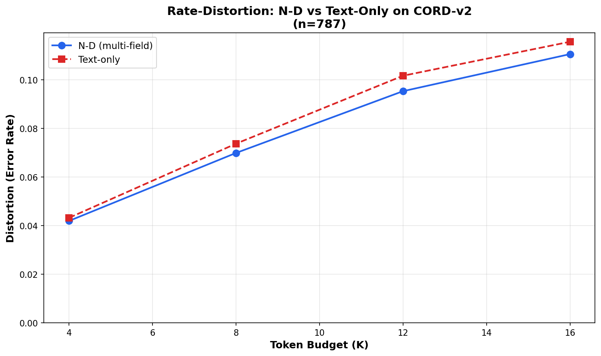

# N‑Dimensional LLM (ND‑LLM)

[](https://github.com/warrofua/n-dimensional-llm/actions/workflows/ci.yml)
[](https://www.python.org/downloads/)
[](https://opensource.org/licenses/Apache-2.0)

**Grounded, multi‑field language models with information‑bottleneck compression and semantic tensor memory.**

> Build LLMs that reason across *N* synchronized fields (text, layout, space, time, sensors, …) while using **variable‑rate token bottlenecks**—guided by information‑bottleneck / rate–distortion objectives—to slash context load without sacrificing fidelity. Persist compressed states in **Semantic Tensor Memory (STM)** and adapt over time via an **Auto‑IB Orchestrator**.

---

## Why N‑D now?

* **Reality is not 1‑D text.** Many tasks require aligned signals (words ↔ layout ↔ time ↔ coordinates ↔ audio/video ↔ metadata).
* **Context is scarce.** Token budgets and latency matter; naive concatenation wastes capacity.
* **Compression should be *learned***—and **query‑aware**—not a post‑hoc heuristic.

**Key takeaway:** When tasks depend on conditionally informative signals beyond text, collapsing everything into a 1‑D projection permanently loses mutual information; synchronized N‑D inputs keep that utility and dominate the rate–distortion trade‑off. See the [full derivation](docs/why-nd-inputs.md) for the proof, the metatheoretical, code-forward whitepaper [*The Tensor Is The Message*](docs/the-tensor-is-the-message.md) for design laws, scaffolding, and quotable guidance, and the [Related Work & Novelty overview](docs/related-work-novelty.md) for the surrounding research landscape.

---

## Empirical Validation

**N-D encoding consistently beats text-only at fixed token budget.** On CORD receipt understanding (n=787), N-D multi-field encoding (text + layout + amounts) achieves **lower distortion** than text-only baselines across all token budgets tested (K ∈ {4, 8, 12, 16}).

<p align="center">
  
</p>

**Figure 1:** Rate-distortion curves on CORD-v2 receipt total classification. At every budget level, N-D encoding maintains lower error rates, validating the information-theoretic predictions. Distortion = classification error rate; lower is better.

| Budget (K) | N-D Distortion | Text-Only Distortion | ND Advantage |
|------------|----------------|----------------------|--------------|
| 4          | 0.0419         | 0.0432               | **-0.0013**  |
| 8          | 0.0699         | 0.0737               | **-0.0038**  |
| 12         | 0.0953         | 0.1017               | **-0.0064**  |
| 16         | 0.1105         | 0.1156               | **-0.0051**  |

*Full results: [`runs/cord_rd_sample.json`](runs/cord_rd_sample.json)*

**Reproducibility:**
```bash
# Run rate-distortion audit on local CORD dataset
python -m scripts.rd_audit --budgets 4 8 12 16 --dataset-size 800 \
    --data-root datasets/CORD --output runs/cord_rd_sample.json

# Generate comparison plot
python scripts/plot_rd_comparison.py
```

**Key insight:** Even with simple stub encoders, multi-field inputs provide measurable gains. With production encoders (LayoutLM, etc.), the gap would be larger.

---

## Core concepts

### 1) Field Registry & Synchronization

A first‑class schema for declaring input “fields” and their alignments (indices, coordinates, timestamps, salience). The registry is how encoders agree on *where* a token came from and *how* it lines up with others.

* Declarative field types (e.g., `text`, `bbox`, `image_patch`, `timestamp`, `3d_pose`, `audio_chunk`, `sensor_feature`).
* Cross‑field alignment keys (e.g., `doc_id`, `frame_id`, `entity_id`, `t`).
* Optional *salience* / *uncertainty* channels for downstream compression.

### 2) Variable‑Rate Token Bottleneck (IB/RD‑guided)

A learnable compression layer between encoders and the decoder. It chooses **how many** tokens to pass and **which** ones—*per query and per example*—balancing utility vs. cost.

* Optimized with **Information Bottleneck** and **Rate–Distortion** proxies.
* Supports multiple mechanisms: summary tokens, top‑k routing, MoE gates, product quantization, or learned entropy models.
* Exposes a **budget knob** (target bits/tokens) and collects **usage telemetry** for later tuning.

### 3) Semantic Tensor Memory (STM)

A long‑horizon store of compressed states (Z) and metadata. Think: deduped, query‑addressable, versioned *semantic shards*.

* Saves bottleneck outputs + field keys + task labels.
* Enables retrieval of *compressed* context instead of raw history.
* Supports background audits: retention, drift, reconstruction quality.

### 4) Auto‑IB Orchestrator

A control loop that probes what the model remembers, tunes bottleneck budgets, re‑balances per field, and triggers fine‑tuning when drift or loss is detected.

* Active‑testing hooks (e.g., counterfactual prompts, canary questions).
* Budget scheduling (tighten/loosen by task, user, or SLA).
* “Pay with bits only when it pays with accuracy.”

#### Operating the Auto‑IB Orchestrator

* Wrap each STM append in a :class:`UsageEvent` that can carry the compressed tensor **and** a :class:`CompressionRecord`. Telemetry such as selected indices, token counts, IB/Ml lower bounds, constraint verdicts, and canonical cell artefacts are captured under ``metadata["compression"]`` and mirrored in the STM index.
* Call :func:`Orchestrator.tune_budget` periodically (e.g., after processing a batch). The default :class:`CompressionRatioBudgetStrategy` looks at the recent compression ratios and adjusts ``Orchestrator.config.target_budget`` upward when quality drops or downward when utilisation saturates. Inspect ``Orchestrator.budget_history`` to audit the decisions.
* Trigger :func:`Orchestrator.run_retention_probe` on a schedule to sample STM entries, reconstruct them with the stored :class:`~nd_llm.bottleneck.ib.IBottleneck` telemetry, and monitor reconstruction quality / drift. Any missing or malformed telemetry is surfaced under ``probe["issues"]``.
* Use the new STM query helpers such as :func:`STM.query` or :func:`STM.list_by_alignment`, plus the holographic superposition channels (``write_superposition``/``read_superposition``) to fetch aligned batches of entries or aggregate long-horizon fingerprints without loading every payload.

---

## Architecture (high level)

```
        [ Field A ]  →  Encoder_A  ┐
        [ Field B ]  →  Encoder_B  ┼─►  Variable‑Rate Bottleneck  ─►  Decoder/LLM  ─►  Outputs
        [ Field C ]  →  Encoder_C  ┘              │
                                                 ▼
                                            Semantic
                                         Tensor Memory
```

---

## Repo layout

```
.
├── nd_llm/                 # Library code (registry, encoders, bottleneck, STM, orchestration, utils, metrics)
├── benchmarks/            # Evaluation harnesses and synthetic/sample datasets
│   └── data/              # Bundled JSONL samples for offline smoke tests
├── docs/                  # Design notes, derivations, and research context
│   └── Toward N-Dimensional LLMs with Information Bottlenecks.pdf  # Research draft (replace with yours)
├── examples/              # Runnable demos / notebooks
├── scripts/               # Training, evaluation, data prep CLIs
├── tests/                 # Unit and smoke tests covering the public API
├── README.md
├── LICENSE
├── CITATION.cff
├── pyproject.toml
```

---

## Quickstart

> **Status:** research pre‑release. The code skeleton below shows the intended API; swap in your encoders/LLM as you prototype.
> For a maintained end-to-end walkthrough, see [`examples/multi_field_invoice.py`](examples/multi_field_invoice.py).

### Installation

```bash
# clone
git clone https://github.com/warrofua/n-dimensional-llm.git
cd n-dimensional-llm

# (optional) create env
python -m venv .venv && source .venv/bin/activate

# editable install
pip install -e .

# install and activate the repo's git hooks
pip install pre-commit
pre-commit install
```

### “Hello, N‑D” (pseudo‑Python)

```python
from nd_llm import (
    IBottleneck,
    Orchestrator,
    Registry,
    STM,
    UsageEvent,
    CompressionRecord,
    pack_fields,
)
from nd_llm.encoders import LayoutEncoder, TextEncoder

# 1) Register fields + encoders
registry = Registry()
registry.add_field("text", keys=["doc_id", "span_id"], salience=True)
registry.add_field("bbox", keys=["doc_id", "span_id"])
registry.register_encoder("text", TextEncoder())
registry.register_encoder("bbox", LayoutEncoder())

# 2) Pack aligned examples
spans = [("hello", True), ("world", False)]
boxes = [(0, 0, 1, 1), (1, 1, 2, 2)]
fields = pack_fields(
    text=[
        {"doc_id": 1, "span_id": idx, "text": text, "salience": salience}
        for idx, (text, salience) in enumerate(spans)
    ],
    bbox=[
        {"doc_id": 1, "span_id": idx, "xyxy": box}
        for idx, box in enumerate(boxes)
    ],
)
batches = fields.to_field_batches({"text": "text"})

# 3) Compress with the information bottleneck
bottleneck = IBottleneck(target_budget=2, objective="query-dot")
result = bottleneck.compress(batches, registry.encoders)

# 4) Persist usage + telemetry via the orchestrator
stm = STM.from_path("./stm-store")
orchestrator = Orchestrator.from_components(
    stm=stm,
    bottleneck=bottleneck,
    target_budget=1.0,
    policy_name="demo",
)
usage_key = orchestrator.log_usage_event(
    UsageEvent(
        tensor=result.telemetry.selected_scores.get("text", []),
        metadata=fields.key_rows[0],
        compression=CompressionRecord.from_result(result, bottleneck=bottleneck),
    )
)
```

### Bottleneck tuning knobs

* **Objective / scoring:** pass `objective="l2-norm"` (default) for magnitude gating or `objective="query-dot"` to enable the built-in query-conditioned scorer. You can also inject your own scorer via the `scorer` argument; it receives `(field, embeddings, metadata, context)` and should return a score per token.
* **Mutual-information blending:** supply an `MIProxy` + `mi_targets` via :func:`build_mi_proxy_context` and set `mi_score_weight` to trade off between the base scorer and per-token MI similarities.
* **Query context:** provide query embeddings or other conditioning signals through the `context` mapping (e.g. `{"query_embedding": vector}`) and they will be forwarded to the scoring strategy.
* **Budget allocator:** override `budget_allocator` to customize per-field sub-budgets. The default `RegistryAwareBudgetAllocator` inspects registry metadata (salience flags, alignment keys, optional `budget_weight`) and records the resulting `field_budgets` and `allocation_weights` in `CompressionTelemetry`.
* **Metrics:** every call to `compress` returns a `CompressionResult.metrics` dictionary with IB/RD proxies such as `ib_proxy`, `rd_proxy`, and an `embedding_reconstruction_error` computed from kept vs. dropped embeddings.

### Minimal field‑registry (YAML)

```yaml
fields:
  text:
    keys: [doc_id, span_id]
    salience: true
  bbox:
    keys: [doc_id, span_id]
  timestamp:
    keys: [doc_id, frame_id, session_id, t]
  audio_chunk:
    keys: [session_id, t]

affinity:
  - [text, bbox, by: [doc_id, span_id]]
  - [text, timestamp, by: [doc_id]]
  - [audio_chunk, timestamp, by: [session_id, t]]
```

---

## Using real datasets

The [CORD receipt dataset](https://huggingface.co/datasets/naver-clova-ix/cord-v2) is wired into the benchmark harness for a realistic document-understanding task. Install the optional dependency stack (``pip install .[benchmarks]`` or the explicit packages below) when you want the full dataset instead of the bundled JSONL sample:

```bash
pip install datasets pillow
```

```bash
python - <<'PY'
from benchmarks.doc_understanding import run_cord_benchmark

report = run_cord_benchmark(
    budget_values=(4, 8, 12),
    dataset_size=8,
    use_sample=True,  # flip to False to stream the HF split or use a local directory
    data_root="datasets",  # automatically combines subdirectories named CORD*
    threshold=250_000,
)
print(report["budgets"][0]["metrics"])  # inspect results
PY
```

Set ``data_root`` to the directory that contains the official ``train/dev/test/json`` folders (or to a parent folder that has subdirectories named ``CORD*``—the loader will merge them) once you download the [CORD release](https://github.com/clovaai/cord).

### ChartQA field benchmark

ChartQA-style chart reasoning now has a lightweight harness that exercises question text alongside structured chart metadata. The default configuration consumes the bundled sample; point it at the official dataset (e.g. [lmms-lab/chartqa](https://huggingface.co/lmms-lab/chartqa) or the [GitHub release](https://github.com/IBM/chartqa)) when you want full coverage:

```python
from benchmarks.chartqa import run_chartqa_benchmark

report = run_chartqa_benchmark(
    budget_values=(2, 4, 6),
    dataset_size=4,
    use_sample=True,  # set False once you've downloaded the dataset locally
)
print(report)
```

### Rate–distortion & Fano audits

Use the `scripts/rd_audit.py` CLI to sweep token budgets for the CORD benchmark in both N-D and text-only configurations, then compute empirical rate–distortion curves and Fano-consistent error bounds:

```bash
python -m scripts.rd_audit --budgets 4 8 12 --dataset-size 8 --use-sample
```

Both modes record the mean mutual-information lower bound (from the MI proxy) alongside each budget’s accuracy/distortion so you can visualise the dominance of N-D inputs at fixed rate.

### Local LLM harness (Ollama)

If you have [Ollama](https://ollama.com) with `llama3.1:8b` installed locally, you can replay compressed field summaries into the model for qualitative checks:

```bash
python -m scripts.ollama_harness \
  --dataset cord \
  --data-root datasets \
  --use-sample \
  --dry-run
```

Drop `--dry-run` to stream the prompt to your Ollama instance (`http://127.0.0.1:11434` by default). ChartQA prompts are supported as well (`--dataset chartqa`).

### Runnable multi-field invoice demo

Kick the tyres with the maintained invoice walk-through that wires the registry, stub encoders, bottleneck, STM, and orchestrator together:

```bash
python examples/multi_field_invoice.py
```

The script prints the compression metrics, persisted STM metadata, and probe outputs so you can verify each step of the pipeline end-to-end.

### Training & evaluation scripts

Prototype end-to-end training and rate–distortion sweeps with the bundled CLIs:

```bash
# fine-tune the NDEncoderDecoder scaffold on synthetic invoices
python scripts/train.py --epochs 1 --dataset-size 24 --budget 8 --output runs/train.json

# evaluate rate–distortion across token budgets (optionally pass --checkpoint)
python scripts/eval_rd.py --budgets 4 8 12 --dataset-size 24 --output runs/rd.json
```

Both commands emit JSON summaries (loss terms, accuracies, token usage) so the quickstart results can be versioned alongside the README benchmarks.

### Smoke tests

A lightweight CI-friendly check executes the demo and benchmark harness:

```bash
pytest tests/examples/test_multi_field_invoice.py tests/benchmarks/test_doc_understanding.py
```

Running the smoke tests locally mirrors the automation that keeps the public demos aligned with the evolving API.

---

## Benchmarks

The `benchmarks/` package now ships with a synthetic doc-understanding harness that measures accuracy vs. token budget using the invoice dataset utilities and orchestration probes. For a lightweight CLI that emits README-compatible JSON, run:

```bash
python scripts/eval_rd.py --budgets 4 8 12 --dataset-size 24 --output runs/rd.json
```

You can still invoke the richer benchmark module directly when you want orchestrator telemetry and STM probes:

```bash
python -m benchmarks.doc_understanding
```

The default report evaluates several budgets on a repeatable dataset; tweak the parameters inside `benchmarks/doc_understanding.py` or import `run_benchmark` from Python to sweep your own ranges. Synthetic generators live alongside the harness (`benchmarks/synthetic.py`) and mirror the fixtures exposed under `tests/fixtures/` for reproducible experiments.

---

## Roadmap

### Shipped milestones

* [x] MVP: registry + two encoders (text/layout) + simple top-k bottleneck — [`nd_llm/registry`](nd_llm/registry), [`nd_llm/encoders`](nd_llm/encoders)
* [x] IB/RD proxies + target-budget API — [`nd_llm/bottleneck`](nd_llm/bottleneck)
* [x] STM v0 (append-only, local FS) + retrieval hooks — [`nd_llm/stm`](nd_llm/stm)
* [x] Orchestrator v0 (budget sweeps, retention probes) — [`nd_llm/orchestration`](nd_llm/orchestration)

### In flight / upcoming

* [ ] Example notebooks + tiny benchmarks to showcase multi-field tasks end-to-end
* [ ] Paper alignment: figures, ablations, and narrative refinements for the public draft

---

## Research artifact

The working draft lives at `docs/Toward N-Dimensional LLMs with Information Bottlenecks.pdf`. 

---

## Citing

If you use or build on this work, please cite the accompanying paper.
You can also find ready-to-use metadata in [CITATION.cff](CITATION.cff).

```bibtex
@misc{farrow2025ndllm,
  title        = {Toward N-Dimensional LLMs with Information Bottlenecks},
  author       = {Farrow, Joshua},
  year         = {2025},
  url          = {https://github.com/warrofua/n-dimensional-llm},
  note         = {Preprint}
}
```

---

## Contributing

PRs and issues welcome. Please:

1. Open an issue describing the problem or proposal.
2. Include a minimal repro (dataset slice, config, expected behavior).
3. Target clean, typed code with tests where possible.

Code of conduct and contribution guide will live in `CONTRIBUTING.md`.

---

## License

This project is licensed under the [Apache License 2.0](LICENSE), offering a permissive grant for use, modification, and distribution while protecting contributors with an explicit patent license.

---

## Maintainer

**Joshua Farrow** — research & design.

For questions: open a GitHub issue or ping on X/Twitter `@jfarrow`.
